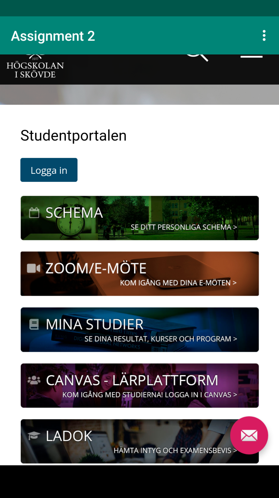
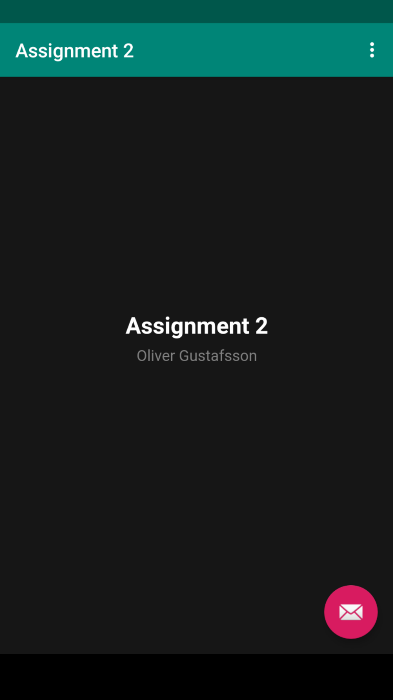

# Rapport

Jag började med att ändra namnet på appen till _Assignment2_. Därefter lade jag till följande kod i manifesten:

`<uses-permission android:name="android.permission.INTERNET" />`

Implementeringen av denna kod gav appen tillåtelse att hämta data från internet. 

Därefter bytte jag ut TextView i [content_main.xml](https://github.com/a21oligu/mobileapp-programming-webview/blob/master/app/src/main/res/layout/content_main.xml) mot en WebView. Denna WebView gav jag även id:n "my_webview". Jag kunde efter det hämta komponenten med metoden _findById(R.id.my_webview)_ och tilldela den till den privata variabeln webView jag skapade. För att kunna ladda en intern html fil, behövde jag också skapa en assets mapp. Detta för att appen ska veta var filen ska hämtas ifrån. I assets mappen skapade jag ännu en map vid namn html. I denna skapades filen assignment2.html, som är den interna html filen som laddas av appen. 

För att ladda filerna användes metoden _loadUrl_ från webView i de två metoderna i kodblocket nedan:

```
private String external_url = "https://student.his.se";
private String internal_url = "file:///android_asset/html/assignment2.html";

public void showExternalWebPage(){
    this.webView.loadUrl(external_url);
}

public void showInternalWebPage(){
    this.webView.loadUrl(internal_url);
}
```

Dessa metoderna kallades sedan när användaren använde respektive knapp i _OptionsMenu_, se kodblocket nedan:

```
public boolean onOptionsItemSelected(MenuItem item) {
    int id = item.getItemId();

    if (id == R.id.action_external_web) {
        showExternalWebPage();
        return true;
    }

    if (id == R.id.action_internal_web) {
        showInternalWebPage();
        return true;
    }

    return super.onOptionsItemSelected(item);
}
```

Efter knapparna blivit tryckta renderas filen i appen. Resultaten går att se i bilderna nedan:

### Extern


### Intern

